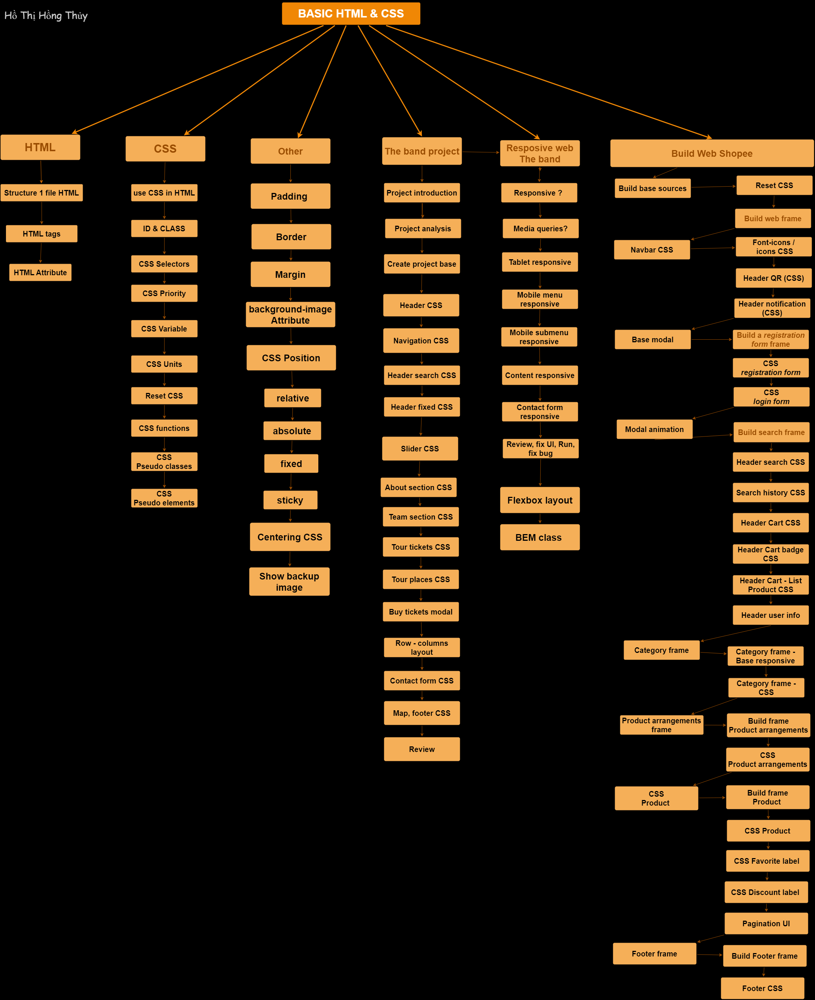

# F8-HTML-CSS
## Basic HTML-CSS programming at F8
***
>[Myreport](https://docs.google.com/document/d/17Dmw9fUJfpM4qIYk1pLFmWJRaSrR5O0e/edit#)

1. Xây dựng được giao diện website
2. Phân tích giao diện website
3. Đặt tên class theo chuẩn BEM
4. Xây dựng layout với Flexbox
5. Làm hiệu ứng animation
6. Xây dựng giao diện responsive
7. Kỹ thuật nâng cao khác
## Mindmap

